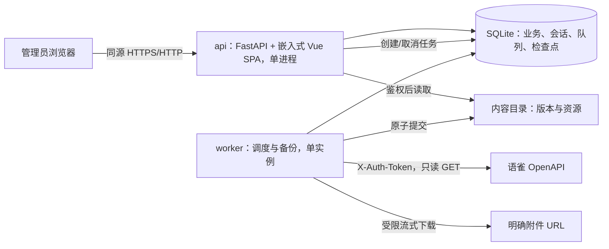

# Yuque-Backup MVP 技术方案文档

> 文档状态：已确认并完成 v1.2.0 实现\
> 版本：v1.2.0\
> 编写及技术调研日期：2026-07-23  
> 实现校准与验收日期：2026-07-26\
> 输入依据：[需求文档.md](需求文档.md)  
> 范围：技术选型、系统架构、数据与权限、关键依赖、异常处理、部署和项目结构；详细 API 文档另行编写

## 1. 方案结论

MVP 采用一个仓库、三个运行组件、一个关系数据库和一个内容目录：

- 前端：基于 `tabtab-dev/tabtab-admin` 固定提交二次开发，保留 Vue 3、TypeScript、Vite/Rolldown、Tailwind CSS v4、shadcn-vue/Reka UI、Pinia 和 Vue Router 4 单应用底座；
- API：Python 3.13、FastAPI、同步 SQLAlchemy 2、Alembic；
- 后台任务：同一后端代码构建的单独 `worker` 进程，使用 HTTPX 异步请求语雀和资源，APScheduler 仅负责 Cron 唤醒；
- 持久化：SQLite 保存业务数据、队列和检查点；本地内容目录保存正文快照和二进制资源；
- 部署：Vite 生产产物嵌入 FastAPI，并通过 PyInstaller 生成一个统一可执行文件；同一最终镜像以 `migrate`、`api`、`worker` 子命令保持进程隔离，不引入 Redis、PostgreSQL、Celery、S3 或 WebDAV；
- 通信：前端与 API 使用同源 REST/JSON；任务状态由前端短轮询，不引入 WebSocket；
- 架构形态：模块化单体，不拆微服务，不使用事件总线。

该方案满足单机部署、单管理员、单总备份任务和低并发的 MVP 约束，同时保留将 SQLite 或本地存储替换为其他实现的模块边界，但 MVP 不实现这些替换能力。

## 2. 设计原则

1. **正文优先：** 资源失败不得回滚已取得的可用正文。
2. **数据库驱动：** 任务、重试时间、额度等待、租约和检查点全部持久化，内存状态不作为事实来源。
3. **单写者优先：** 只运行一个 worker，缩短 SQLite 写事务，避免为低并发场景引入消息队列服务。
4. **不可变内容：** 已提交的版本文件和资源不原地覆盖；变更生成新版本或新对象。
5. **官方 API 隔离：** 官方 OpenAPI 客户端与未公开附件兼容适配器分离，兼容失败只生成问题记录。
6. **默认安全：** Token 最小暴露、下载必须鉴权、预览禁止主动内容、外部下载防 SSRF。
7. **前端继承：** 复用 `tabtab-dev/tabtab-admin` 的单应用结构、布局、组件、样式、路由和状态管理，不另建前端底座。

## 3. 调研结论与技术选型

### 3.1 tabtab-dev/tabtab-admin 适配结论

实际实现采用上游固定提交 `fd2acc2064a66bb8849a321f26449d7d3bd6e730`，导入日期为 2026-07-23。仓库提供 Vue 3 单应用底座，当前项目锁定 Vue 3.5、TypeScript 5.9、Vite/Rolldown 7.3、Tailwind CSS v4、shadcn-vue/Reka UI、Pinia 3、Vue Router 4 和 pnpm 10.29.1；要求 Node.js `^20.19.0` 或 `>=22.12.0`。

**适配判断：**

- Admin 的侧边栏、面包屑、标签页、主题、表格、表单、Toast 和路由能力能够覆盖本项目六类页面；
- 其生产物是静态 SPA，可与任意 REST 后端同源部署，没有必须采用 Node.js 后端的限制；
- 上游认证为模拟实现，需要替换为本项目的服务端会话，但不需要更换 Vue、Pinia、路由或 UI 组件；
- 单应用未内置固定的服务端数据方案，MVP 使用原生 `fetch` 封装 API 客户端，不额外引入 Axios 或另一套服务端状态框架；
- 项目保留上游单应用目录与 `pnpm-lock.yaml`，通过 `UPSTREAM.md` 固定来源，不在发布分支无审查跟随上游。

**许可证结论：** `tabtab-dev/tabtab-admin` 使用 MIT 许可证；当前仓库已保留上游 `LICENSE` 和版权声明，并在 `frontend/UPSTREAM.md` 记录固定提交与本地改造范围，原技术方案中的许可证阻塞已关闭。

### 3.2 后端选型

| 层级 | 选择 | 采用原因 | MVP 不采用 |
| --- | --- | --- | --- |
| 语言 | Python 3.13 | JSON/HTML 处理、异步 HTTP、SQLite 和 Web API 生态成熟；实现量小 | Go 会增加数据映射和迁移样板；Node 后端不会减少前后端边界 |
| Web API | FastAPI 0.139.x + Uvicorn 0.51.x | 类型校验、依赖鉴权、OpenAPI、流式响应成熟 | Django 功能过重；Flask 需要补充较多约束 |
| ORM/迁移 | SQLAlchemy 2.0.x + Alembic 1.18.x | 显式事务、SQLite 支持、迁移机制成熟 | 不直接拼接业务 SQL；不使用自动建表替代迁移 |
| HTTP 客户端 | HTTPX 0.28.x | 异步流式请求、超时、连接池和重定向控制 | 不使用浏览器自动化抓取正文或附件 |
| 调度 | APScheduler 3.11.3 | 稳定版支持五段 Cron 和 IANA 时区 | 不采用尚未稳定的 v4 API；不把它当持久化任务队列 |
| 数据库 | SQLite 3，WAL 模式 | 单机低并发、事务和备份队列足够，运维最少 | 不引入 PostgreSQL、Redis 或外部消息队列 |
| 密码 | Argon2id（argon2-cffi） | 专用慢哈希，参数可升级 | 不使用通用 SHA-256 保存密码 |
| Token 加密 | cryptography 的 AES-256-GCM | 认证加密并可检测密文篡改 | 不自定义加密算法 |
| HTML 安全 | nh3 + lxml | allowlist 清理与 DOM 链接重写职责分离 | 不直接把语雀 HTML 交给 `v-html` 执行 |
| 配置 | pydantic-settings | 环境变量校验和敏感配置分离 | 不把主密钥写入数据库或代码仓库 |

Context7 的最新官方资料确认：FastAPI 应使用 lifespan 管理应用资源；Cookie 可通过安全依赖统一鉴权；长时备份不适合放入请求后的 `BackgroundTasks`。SQLAlchemy 2 推荐显式事务；其 `aiosqlite` 实际以每连接后台线程包装 SQLite，并不提供网络数据库式异步 I/O，因此本方案使用同步 SQLAlchemy 处理短数据库事务，把异步并发集中在 worker 的 HTTP I/O。

### 3.3 依赖固定策略

- `pyproject.toml` 声明直接依赖，锁文件固定完整依赖树；Docker 构建必须使用 frozen 模式；
- 上表的补丁版本是 2026-07-23 调研基线，开发开始时只允许升级到同一兼容线内已验证版本；
- APScheduler 固定 `3.11.3`，不得自动解析到 v4；
- 前端固定上游提交、pnpm 版本和 lockfile；升级前必须通过构建、类型检查和核心页面回归；
- 第三方依赖在发布前生成 SBOM，并检查许可证；不得复制《需求文档.md》中明确排除的无许可证或 SATA 项目代码。

## 4. 系统架构



### 4.1 运行服务

| 服务 | 副本 | 职责 | 禁止事项 |
| --- | --- | --- | --- |
| `api` | 1 | 提供嵌入式 Vue SPA，并负责初始化、登录、配置、查询、手动触发、取消、预览和下载 | 不直接执行长时备份，不直接调用语雀 |
| `worker` | 1 | Cron、任务协调、语雀请求、资源下载、版本提交、保留清理和恢复租约 | 不提供公网端口，不允许多副本 |
| `migrate` | 一次性 | 容器启动前执行 Alembic 升级并退出 | 失败时禁止 API/worker 启动 |

`migrate`、`api` 和 `worker` 使用同一统一可执行文件的不同子命令。MVP 固定单 API 进程和单 worker，避免 SQLite 锁竞争和 Cron 重复执行；未来若需要横向扩展，必须先更换数据库和任务协调方案，不属于本次设计。

### 4.2 后端模块

| 模块 | 职责 |
| --- | --- |
| `auth` | 唯一管理员、初始化、登录、会话、修改密码、CSRF |
| `credentials` | Token 加密、验证、启停、额度快照、主体识别 |
| `repositories` | 个人/团队知识库发现、选择、主凭据、目录树 |
| `yuque_client` | 官方只读 GET、分页、响应模型、额度头；不含未公开接口 |
| `backups` | 总任务、子任务、触发合并、队列、检查点、取消和状态汇总 |
| `documents` | 增量、删除、六种类型解析、版本哈希和最新指针 |
| `assets` | 明确附件发现、SSRF 校验、流式下载、SHA-256 去重和引用 |
| `preview` | HTML 清理、资源链接本地化、Sheet/Table 标准化 |
| `retention` | 版本过期、删除保留、墓碑、引用安全回收和清理审计 |
| `settings` | Cron、时区、保留期、单资源上限和存储统计 |

未公开附件 URL 转换位于 `compatibility` 适配器，默认关闭或按域名单独验证。它不能进入 `yuque_client`，失败也不能影响正文提交。

## 5. 任务与同步设计

### 5.1 触发和单任务约束

1. APScheduler 只运行在 `worker`，读取数据库中的一个全局 Cron 和 IANA 时区；使用 `CronTrigger.from_crontab()`、`coalesce=true`、`max_instances=1`。
2. Cron 和手动触发都先写入 `job_trigger`；同一事务内通过唯一活动锁确保最多一个运行总任务。
3. 运行期间的新触发合并到唯一 `pending_trigger`：相同范围去重，不同范围取并集，不逐次排队。
4. worker 启动时先恢复未完成任务和过期租约，再补处理到期的 Cron；幂等键防止重复创建同一计划任务。
5. 管理员取消只写 `cancel_requested_at`；worker 在当前原子单元结束后停止，已提交内容和检查点保留。

### 5.2 持久化队列

SQLite 中的 `queue_item` 是唯一队列事实来源，至少保存：任务、子任务、凭据、知识库、文档、类别、优先级、状态、尝试次数、`available_at`、`next_retry_at`、租约持有者、`lease_until`、幂等键和最后错误摘要。运行中的文档项可在 `payload._activity` 保存当前阶段、文档、资源进度和退避快照，供任务详情轮询展示；该快照不参与业务幂等判断。

- worker 在短事务中领取到期项并写租约，事务提交后才执行网络请求；
- 崩溃后，超过 `lease_until` 的运行项回到可执行状态；
- 每个凭据使用独立 OpenAPI 通道和 `asyncio.Semaphore(1)`；
- 验证后相同主体的凭据归入同一额度桶，用于聚合主动限速；429 仍只改变实际命中凭据的状态；
- API 请求池与资源下载池分离，资源默认并发 4，可配置但不在 UI 暴露；
- 资源下载不能占用其他凭据的 OpenAPI 通道；
- 队列只存业务参数和资源标识，不序列化可执行函数或 Token。

### 5.3 首次和增量流程

1. 验证凭据并发现个人、团队和知识库；按规范化 `base_url + book_id` 去重并确认主凭据。
2. 首次任务获取知识库详情、TOC、当前文档列表和详情，只保存当前版本。
3. 后续任务先同步知识库和 TOC，再以“已完成安全水位减 5 分钟”查询 `changed_at_gte`，同时查询 `deleted=true`。
4. 仅对变化项或本地缺失项请求详情；通过 `repository_id + doc_id` 定位文档，通过规范化内容哈希去重版本。
5. `Table` 按 `page_size=200` 获取全部分页；任一分页失败时保存已取得原始数据并标记部分成功。
6. 变化枚举完成，且所有变化项已提交或进入持久化重试后，才推进安全水位。

### 5.4 版本原子提交

1. 将原始响应、原始正文、标准化元数据、资源清单和清理后的 HTML 写入内容目录同一文件系统的临时区。
2. 对每个文件计算大小和 SHA-256，写入 manifest；必要时执行 `fsync`。
3. 使用原子重命名移动到不可变最终路径；同哈希目标已存在时复用。
4. 在一个短数据库事务中写版本、资源引用和问题，并更新最新可浏览版本指针。
5. 数据库失败时最终文件可能成为无引用对象，由启动核对或清理任务回收；数据库绝不能记录尚未完成重命名的文件。
6. 明确附件全部成功则版本为“完整”；正文可用但附件或特殊结构失败则为“部分成功”；图片和普通外链不属于计划资源，不影响完整性；正文不可提交则不更新最新指针。

### 5.5 保留与清理

- 活动文档永远保留最新一个完整或部分成功版本；
- 其他版本按本地完成时间应用默认 15 天保留期；
- 删除文档按官方 `deleted_at` 计时，到期后删除正文版本及零引用资源，并永久保留墓碑；
- `version_asset` 是资源引用的事实来源；删除物理资源前必须在事务内确认 `NOT EXISTS` 引用，缓存引用数不能单独作为删除依据；
- 清理与备份使用数据库互斥锁，不能同时修改同一文档或资源；
- 清理结果记录版本数、资源数、失败数和释放字节数。

## 6. 数据设计

### 6.1 SQLite 配置

- 文件数据库，不使用 `:memory:`；
- `PRAGMA journal_mode=WAL`；
- `PRAGMA foreign_keys=ON`；
- `PRAGMA synchronous=FULL`，优先保证备份元数据耐久性；
- `PRAGMA busy_timeout=5000`，写事务保持短小；
- 所有数据库时间以 UTC 保存，API 输出 ISO 8601，界面按设置时区显示；
- 迁移只由 `migrate` 服务执行，Alembic 版本不匹配时拒绝启动。

SQLite 数据库必须位于宿主机本地文件系统。SQLite 官方说明 WAL 依赖同主机共享内存，不能可靠工作在网络文件系统；因此 NAS 只用于 `/data/content`，不得承载 `/data/db`。这是对“宿主机挂载 NAS”场景的必要技术约束，不改变 NAS 内容存储能力。

### 6.2 核心表

| 表 | 关键内容与约束 |
| --- | --- |
| `admin` | 固定单行约束、唯一用户名、Argon2id 哈希、密码版本 |
| `admin_session` | 会话令牌哈希、CSRF 哈希、过期、撤销和最近使用时间 |
| `yuque_credential` | 基础域名、AES-GCM 密文/nonce/key 版本、主体、状态、额度和重试时间 |
| `rate_limit_bucket` | 按域名和语雀主体聚合主动限速状态；凭据隔离失败状态 |
| `repository` | 唯一 `normalized_base_url + book_id`、元数据、选择状态和安全水位 |
| `repository_credential` | 唯一知识库/凭据关系；每库最多一个主凭据 |
| `toc_item` | 知识库、远端节点、父节点、doc_id、顺序、标题和原路径 |
| `document` | 唯一 `repository_id + doc_id`、类型、标题、路径、删除时间、最新成功指针 |
| `document_version` | 唯一 `document_id + content_hash`、远端版本、文件相对路径、完整性和来源任务 |
| `asset` | 唯一 SHA-256、大小、MIME、相对路径和校验状态 |
| `version_asset` | 版本、资源、原始/安全 URL、位置、名称和下载状态 |
| `backup_job` | 触发方式、范围、状态、计数、取消和时间 |
| `backup_subtask` | 按凭据/知识库拆分的状态、额度等待和计数 |
| `backup_issue` | 稳定错误码、安全摘要、归属对象、尝试次数和时间 |
| `job_trigger` | Cron/手动触发、幂等键、范围和合并状态 |
| `queue_item` | 持久化请求/资源工作项、租约、重试和执行时间 |
| `sync_checkpoint` | 文档/资源阶段、安全水位和完成标记 |
| `app_setting` | Cron、时区、资源上限和设置版本 |
| `retention_policy` | 保留天数和最后修改时间 |
| `deletion_tombstone` | 永久保存域名、库/文档 ID、标题、原路径、删除/清理时间和任务 |

### 6.3 索引与一致性

- 对所有外键、状态加可执行时间、任务开始时间、文档标题/路径和删除时间建索引；
- 使用 SQLite 部分唯一索引或单行锁表保证只有一个运行总任务、一个待合并触发和每库一个主凭据；
- 标题搜索使用转义后的 `LIKE` 与普通索引可接受 10,000 篇规模；MVP 不启用 FTS；
- 外部 URL、Token、错误响应在入库前脱敏；原始 API 响应可以保存正文数据，但不得保存请求头；
- 失败版本不得更新 `latest_successful_version_id`；部分成功版本可以更新，但必须保留完整性标记。

### 6.4 内容目录

```text
/data/
├── db/
│   └── yuque-backup.sqlite3
├── content/
│   ├── versions/{repository_id}/{doc_id}/{content_hash}/
│   │   ├── raw-response.json
│   │   ├── body.{ext}
│   │   ├── preview.html
│   │   └── manifest.json
│   ├── assets/sha256/{hash[0:2]}/{hash[2:4]}/{hash}
│   └── .tmp/{job_id}/
```

数据库只保存相对于 `/data` 的路径。临时区与最终内容必须在同一挂载内，确保重命名具有原子性。远端文件名仅作为展示元数据，不能参与实际路径拼接。

## 7. 认证、权限与安全

### 7.1 本地管理员

- `admin` 表以固定键和唯一约束保证只能创建一个管理员；初始化事务中只有第一个请求成功；
- 密码使用 Argon2id，最少 12 个字符；登录失败按来源 IP 和用户名摘要限速；
- 登录生成至少 256 bit 随机会话令牌，数据库只保存令牌哈希；Cookie 使用 `HttpOnly`、`SameSite=Lax`，HTTPS 部署启用 `Secure`；
- 所有修改请求验证 CSRF token；修改密码撤销其他会话；
- 除健康检查、初始化状态、初始化和登录外，全部 API、预览及下载都要求有效会话；
- MVP 只有“管理员”一种身份，不设计 RBAC、角色或知识库级本地权限。

### 7.2 语雀 Token

- 使用 32 字节部署主密钥和 AES-256-GCM 加密，每条凭据使用独立随机 nonce；
- 主密钥通过环境变量或 Docker secret 注入，不进入数据库、镜像、日志或前端；
- API 只返回 Token 尾部掩码，更新时不回显旧值；
- `X-Auth-Token` 仅发送给经过规范化和校验的语雀基础域名，不随跨域重定向转发；
- 日志、问题、OpenAPI 响应归档和诊断信息均执行敏感字段过滤。

### 7.3 预览和资源下载

- 服务端用 nh3 allowlist 删除脚本、事件属性、iframe、object、危险协议和主动加载标签，再由 lxml 改写本地资源；
- 预览通过无 `allow-scripts`、无 `allow-same-origin` 的 sandbox iframe 展示，并设置严格 CSP；不使用 `v-html` 直接注入语雀正文；
- 远程图片不下载、不自动加载，原始 Markdown 保持不变，安全预览使用缺失占位；
- 资源下载只允许 HTTP/HTTPS；DNS 解析和每次重定向后拒绝 loopback、私网、链路本地、保留地址和非允许端口；
- 设置连接、首包、读取和总时限，最多有限次重定向；按 `Content-Length` 和流式累计值执行 500 MB 默认上限；
- 文件下载 API 校验会话并流式读取，不把内容目录作为公开静态目录。

## 8. API 边界

详细路径、字段、示例、分页和错误码在方案确认后另行编写《API 文档.md》。本阶段只确定以下契约原则：

- 统一前缀 `/api/v1`，JSON 字段使用 `snake_case`，时间使用带时区 ISO 8601；
- 资源按初始化/认证、凭据、知识库、文档/版本、任务/问题、设置六组组织；
- 列表统一游标或页码分页，排序规则稳定；
- 错误响应至少包含稳定 `code`、用户可读 `message`、`request_id` 和可选字段错误，不向前端返回堆栈；
- 创建任务和初始化等关键写操作支持幂等键；取消是状态变更，不删除任务；
- 下载使用独立鉴权端点和正确 `Content-Disposition`；路径参数永远不映射为任意文件系统路径；
- 前端每 3 至 5 秒轮询运行任务摘要，进入终态后停止；MVP 不使用 WebSocket/SSE；
- FastAPI 生成的 OpenAPI 作为开发契约基础，但需要人工补充业务状态和错误码后才能形成详细 API 文档。

## 9. 异常与状态处理

| 场景 | 技术处理 | 状态影响 |
| --- | --- | --- |
| 429 | 持久化等待到本地时区次日零点；若 `Retry-After` 更晚则采用更晚时间；当天不自动重复探测 | 对应凭据等待额度；其他凭据继续；管理员可手动检查一次 |
| 网络、408、5xx | 按 2/10/30 秒重试；每次尝试落队列记录 | 耗尽后单项失败，总任务按成果汇总 |
| HTTPS 证书不可验证 | 返回 `RESOURCE_TLS_ERROR`，不重试、不降级 HTTP | 资源失败、正文继续提交并明确提示证书原因 |
| 401/403 | 立即停止对应凭据子任务并撤销未执行项 | 凭据需要处理；其他凭据继续 |
| 文档 404 | 查询删除视图；不能确认删除则记录来源不一致 | 删除或单项失败 |
| 资源超限/无权限/过期 | 停止资源下载，保留 URL 与原因 | 版本和任务部分成功，正文可用 |
| HTML/Sheet/Table 解析失败 | 保存原始数据，禁止输出空白成功预览 | 部分成功 |
| 磁盘不足 | 临时写入失败即停止新提交，不更新版本指针 | 失败或部分成功；旧版本保持 |
| worker 崩溃/重启 | 回收过期租约，读取检查点和 `next_retry_at` | 原任务继续，不重复提交 |
| 取消 | 设置取消标志，在原子单元后停止 | 已取消；检查点保留 |
| 数据库迁移失败 | API 和 worker 均不启动 | 容器不健康，要求管理员处理 |

任务公开状态严格限定为：排队中、运行中、等待额度、成功、部分成功、失败、已取消。队列内部可以使用 `pending/running/retry_wait/succeeded/failed/cancelled`，但不得直接暴露为另一套产品状态。

## 10. 部署方案

### 10.1 部署拓扑

- 前端生产产物：在镜像构建阶段由 Vite 生成并嵌入统一可执行文件；FastAPI 先匹配 `/api` 和 `/health`，再在根路径提供 SPA 与静态资源；开发环境仍使用 Vite `/api` 代理；
- `migrate`：挂载 `/data/db`，执行数据库升级，成功后退出；
- `api`：挂载 `/data/db`（读写）和 `/data/content`（只读），后端 Compose 默认仅暴露到宿主机 `127.0.0.1:8000`；
- `worker`：挂载 `/data/db` 和 `/data/content`（读写），临时区固定为 `/data/content/.tmp`，不提供网络入口；
- `api` 和 `worker` 使用同一主密钥、时区和数据根配置；
- Release 同时发布不可变 `vX.Y.Z` 镜像标签；Compose 为便于首次运行默认使用 `latest`，生产部署应在 `.env` 固定版本标签。预发布版本不更新 `latest`；容器以非 root 用户运行。

推荐宿主机目录：

```text
./data/db       -> /data/db        # 必须为本地磁盘
./data/content  -> /data/content   # 可为本地磁盘或宿主机已挂载 NAS
```

不得把临时区配置成独立 bind mount 或 volume；临时文件与最终内容位于同一个 `/data/content` 挂载内，才能保证跨目录重命名不退化为跨文件系统复制。

若 NAS 用作内容目录，应验证原子重命名、大小写、长文件名、剩余空间查询和断线行为。NAS 断开时按磁盘/存储失败处理，不切换到容器临时层，也不覆盖旧版本。

### 10.2 配置和健康检查

必需配置：`APP_MASTER_KEY`、`DATA_ROOT`、`DATABASE_URL`、`TZ`。会话和 CSRF token 使用密码学安全随机数生成并仅以哈希形式入库，不依赖额外共享密钥。Cron、业务时区、保留天数和资源上限写数据库并由 UI 管理。

- `/health/live`：进程存活，不访问外网；
- `/health/ready`：数据库版本正确、数据库可读写、内容目录可用；
- worker 健康状态：心跳写数据库，仪表盘展示最后心跳；
- 日志输出到 stdout，使用结构化字段 `request_id/job_id/subtask_id/credential_id/repository_id/doc_id`，绝不记录 Token 和 Cookie；
- 不在 MVP 引入 Prometheus、集中日志或通知服务。

## 11. 项目结构

```text
yuque-backup/
├── frontend/                       # tabtab-dev/tabtab-admin 单应用
│   ├── src/
│   │   ├── api/                    # fetch 客户端、Mock、错误和类型映射
│   │   ├── router/                 # 基于会话和初始化状态的路由守卫
│   │   ├── stores/                 # 会话和必要 UI 状态
│   │   ├── views/                  # MVP 业务页面
│   │   └── components/             # 业务组件与 shadcn-vue 组件源
│   ├── pnpm-lock.yaml
│   └── UPSTREAM.md                 # 上游仓库、固定提交、许可证和本地修改
├── backend/
│   ├── pyproject.toml
│   ├── app/
│   │   ├── main.py                 # FastAPI 工厂、lifespan 和嵌入式前端挂载
│   │   ├── cli.py                  # 统一可执行文件子命令与健康检查
│   │   ├── api/                    # /api/v1 路由与依赖
│   │   ├── core/                   # 配置、数据库、安全、日志、错误
│   │   ├── modules/                # auth/credentials/repositories/backups/
│   │   │                           # documents/assets/preview/retention/settings
│   │   ├── integrations/yuque/     # 官方客户端、模型、分页和限速
│   │   ├── storage/                # 临时写、哈希、原子提交和流式读取
│   │   └── worker/                 # Cron、协调器、队列执行器和恢复
│   ├── migrations/                 # Alembic 迁移
│   ├── yuque_backup.spec           # PyInstaller 单文件构建规则
│   └── tests/                      # 单元、集成、故障恢复和安全测试
├── deploy/
│   ├── docker-compose.yaml
│   ├── Dockerfile
│   ├── Dockerfile.dockerignore
│   └── .env.example
├── .github/workflows/              # CI 与 annotated Tag Release
├── scripts/build_unified.py        # 本地统一构建入口
├── 需求文档.md
├── 技术方案文档.md
├── API 接口文档.md
├── 前端快速启动说明.md
├── 后端快速启动说明.md
└── Docker快速运行项目.md
```

模块内部采用薄路由、业务 service、SQLAlchemy model/repository 和 Pydantic schema；不为每个简单操作建立多层抽象。API 与 worker 复用同一业务 service，只有进程入口不同。

## 12. 最小测试范围

- 单元：内容哈希、Cron/时区、退避、状态汇总、HTML 清理、SSRF 地址判断、保留引用计算；
- 数据库集成：唯一管理员、单活动任务、主凭据、版本/资源去重、租约恢复、失败版本不更新指针；
- 语雀客户端契约：分页、429、401/403、404、Table 多页、响应字段缺失；
- 文件故障：中途终止、原子重命名失败、磁盘不足、NAS 断开、无引用对象回收；
- 安全：Token 不出现在 API/HTML/日志，恶意 HTML 不能执行，跨域重定向不携带 Token，下载不能路径穿越；
- 端到端：初始化、登录、凭据验证、首次备份、无变化增量、删除保留、取消续跑和离线浏览。

这些测试直接映射《需求文档.md》的 AC-01 至 AC-11，不增加非 MVP 功能。

## 13. 实施顺序

1. **基础骨架：** 固定并导入 TabTab UI；建立后端、迁移、配置、Compose 和同源代理。
2. **安全与数据：** 初始化/会话、Token 加密、核心表、内容存储和下载鉴权。
3. **备份闭环：** 凭据验证、知识库发现、队列、首次同步、版本提交和任务页面。
4. **可靠增量：** 增量/删除、429、重试、租约、检查点、取消和重启恢复。
5. **预览与资源：** 六种类型、安全 HTML、资源下载、部分成功和历史浏览。
6. **保留与交付：** 清理、墓碑、存储统计、安全测试、Compose 升级验证。

每一阶段都必须保持数据库迁移可回放、Compose 可启动和已有测试通过。详细 API 文档应在第 1 阶段开发前完成并确认。

## 14. 风险与确认项

| 项目 | 结论/处理 | 是否阻塞开发 |
| --- | --- | --- |
| TabTab UI 技术兼容 | Vue SPA 可直接对接 REST，无需更换底座 | 否 |
| TabTab Admin 成熟度 | 固定提交和 lockfile，不跟随主分支漂移 | 否 |
| TabTab Admin 许可证 | 上游为 MIT，已保留 LICENSE、版权声明和 UPSTREAM 记录 | 否，已关闭 |
| SQLite 位于 NAS | WAL 不支持网络文件系统；数据库必须本地，内容可放 NAS | **需确认部署约束** |
| APScheduler v4 | 最新稳定版仍为 3.11.3；MVP 固定 v3 | 否 |
| 附件完整性 | 无官方附件枚举接口；兼容适配器隔离并允许部分成功 | 否，已由需求接受 |

v1.2.0 实施结论：

1. 已按 FastAPI + 单 worker + SQLite + 本地内容目录完成模块化单体实现；
2. SQLite 数据库必须放本地磁盘，NAS 只承载经过验证的内容目录；
3. 前端已迁移到 `tabtab-dev/tabtab-admin` MIT 单应用底座，并完成真实 API 联调。

## 15. 调研来源

除另有说明，以下资料核验日期均为 2026-07-23：

1. [tabtab-dev/tabtab-admin](https://github.com/tabtab-dev/tabtab-admin)：前端单应用底座、技术栈与 MIT 许可证；固定提交见 `frontend/UPSTREAM.md`。
2. `frontend/package.json` 与 `frontend/pnpm-lock.yaml`：当前发布所用 Vue、TypeScript、Vite/Rolldown、pnpm 和 Node.js 版本约束。
3. `frontend/LICENSE`：随源码保留的上游 MIT 许可证文本。
4. [FastAPI 官方文档](https://fastapi.tiangolo.com/)（经 Context7 查询）：lifespan、依赖鉴权、Cookie 安全和 BackgroundTasks 边界。
5. [SQLAlchemy 2.0 官方文档](https://docs.sqlalchemy.org/en/20/)（经 Context7 查询）：显式事务、SQLite 方言和 asyncio/aiosqlite 边界。
6. [APScheduler 官方文档与仓库](https://github.com/agronholm/apscheduler)（经 Context7 查询）：CronTrigger、时区、持久化调度架构和 v4 变化。
7. [APScheduler 3.11.3 Release](https://github.com/agronholm/apscheduler/releases/tag/3.11.3)：截至调研日的最新稳定版本。
8. [SQLite WAL 官方文档](https://www.sqlite.org/wal.html)：WAL 并发模型和网络文件系统限制。
9. [PyPI JSON API](https://pypi.org/)：后端关键依赖的最新稳定版本及 Python 版本要求。
10. [语雀开放 API](https://www.yuque.com/yuque/developer/openapi)及《需求文档.md》已核验 OAS：认证、接口、文档类型、分页、额度和附件边界。
